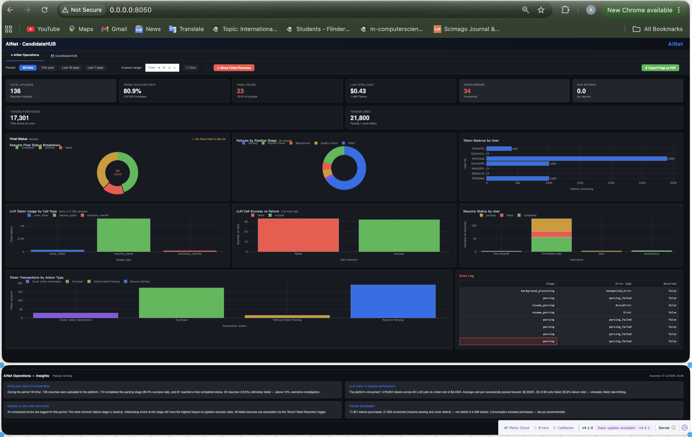

# AI Resume Parser & Multi-Agent Resume Builder - Client Project

A production-style AI application demonstrating how Large Language Models (LLMs), Retrieval-Augmented Generation (RAG), and multi-agent workflows can automate resume parsing, validation, and resume generation.

Note: This repository is a portfolio demonstration. The original production implementation, client-specific business logic, prompts, datasets, deployment configuration, and sensitive code have been removed or simplified to protect confidentiality.
## 📊 Dashboard & Analytics

### AINet - CandidateHUB Dashboard



*Real-time analytics dashboard showing resume parsing metrics, LLM token usage, and system performance*

The platform includes a comprehensive analytics dashboard providing real-time insights into system performance and resume processing metrics.

#### 📈 Key Metrics Overview
- **Total Uploads:** 136 resumes processed
- **Plaques Ingested:** 17,301
- **Parsing Success Rate:** 80.9%
- **Failed Parses:** 23

#### 📅 Time Filters
- All time
- This year
- Last 30 days
- Last 7 days
- Custom range selection

#### 🎯 Performance Analytics

**Token Usage by Call Type:**
- Cover Letter Generation
- Resume Parsing
- Summary Rewriting
- Purchase Operations
- Refund Failed Parsing

**LLM Cost & Usage Efficiency:**
- **Total Tokens:** 1,479,824 across 65 LLM calls
- **Total Cost:** $0.4304
- **Average Cost per Successfully Parsed Resume:** $0.00391
- **Failure Rate:** 33 of 65 calls failed (50.8%) — elevated; likely rate-limiting

**Platform Health Overview:**
During the period 'All time':
- 138 resumes uploaded to the platform
- 1,100 completed the parsing stage (60.9% success rate)
- 61 reached final completion status
- 23 results were unsuccessful

#### 📊 Visual Analytics
The dashboard provides:
- **Token Usage Distribution Charts** by call type
- **Success/Failure Visualizations** (pie charts and bar charts)
- **Failed Resume Tracking** with filtering capability
- **Export Options:** Export Page as PDF

#### 🎨 Dashboard Features
- Real-time data updates
- Interactive filtering
- Visual data representation
- Performance monitoring
- Cost optimization insights
## 🎯 Key Features
- AI-powered PDF and DOCX resume parsing
- Multi-agent workflow using LangGraph
- Structured information extraction
- Resume validation and quality checks
- Resume enhancement suggestions
- ATS-friendly resume generation
- REST API with FastAPI
- Modern React frontend
- PostgreSQL & Vector Database integration
- Cloud-ready architecture
- Real-time analytics dashboard with performance monitoring
### Core Capabilities
- ✅ Parse PDF and DOCX resumes with high accuracy
- ✅ Extract structured data (contact, experience, education, skills)
- ✅ AI-powered validation and enhancement
- ✅ Generate professional resumes in multiple formats (PDF, DOCX)
- ✅ ATS optimization scoring
- ✅ Template-based formatting
- ✅ Real-time processing with progress tracking

## 🏗️ Architecture

### Backend Stack
- **Framework**: FastAPI (async Python web framework)
- **LLM**: Groq AI (llama-3.1-70b-versatile)
- **Agent Framework**: LangGraph for multi-agent orchestration
- **Document Processing**: LangChain + pypdf + python-docx
- **Database**: Supabase (PostgreSQL + Storage)
- **Vector DB**: Supabase pgvector

### Frontend Stack
- **Framework**: React 18 + Vite
- **Styling**: Tailwind CSS
- **State Management**: Zustand
- **HTTP Client**: Axios
- **UI Components**: Custom + Lucide Icons

### Multi-Agent System
```
Document Upload
      ↓
[Document Extraction Agent]
      ↓
[LLM Parsing Agent]
      ↓
[Validation Agent]
      ↓
[Enhancement Agent] (if needed)
      ↓
[Quality Check Agent]
      ↓
[Finalization Agent]
```

## 📦 Installation

### Prerequisites
- Python 3.10+
- Node.js 18+
- Supabase account
- Groq API key

### Backend Setup

1. **Clone and navigate to backend**:
```bash
cd backend
```

2. **Create virtual environment**:
```bash
python -m venv venv
source venv/bin/activate  # On Windows: venv\Scripts\activate
```

3. **Install dependencies**:
```bash
pip install -r requirements.txt
```

4. **Setup environment variables**:
```bash
cp .env.example .env
# Edit .env with your credentials
```

5. **Setup Supabase database**:
```bash
# Run the SQL schema in your Supabase SQL editor
cat schema.sql
```

6. **Create upload directory**:
```bash
mkdir uploads
mkdir logs
```

### Frontend Setup

1. **Navigate to frontend**:
```bash
cd frontend
```

2. **Install dependencies**:
```bash
npm install
```

3. **Setup environment**:
```bash
cp .env.example .env
# Edit .env with your API URL
```

## 🚀 Running the Application

### Start Backend
```bash
cd backend
source venv/bin/activate
python -m app.main
# Or with uvicorn:
uvicorn app.main:app --reload --host 0.0.0.0 --port 8000
```

Backend will run on: http://localhost:8000
API docs: http://localhost:8000/api/docs

### Start Frontend
```bash
cd frontend
npm run dev
```

Frontend will run on: http://localhost:3000

## 📖 API Documentation

### Upload Resume
```http
POST /api/v1/resumes/upload
Content-Type: multipart/form-data

file: <resume-file>
```

Response:
```json
{
  "resume_id": "uuid",
  "filename": "resume.pdf",
  "status": "pending",
  "message": "Resume uploaded successfully"
}
```

### Get Parsed Resume
```http
GET /api/v1/resumes/{resume_id}
```

Response:
```json
{
  "resume_id": "uuid",
  "parsed_data": {
    "contact_info": {...},
    "work_experience": [...],
    "education": [...],
    "technical_skills": [...],
    ...
  },
  "confidence_score": 0.92,
  "ats_score": 85.5,
  "status": "completed"
}
```

### Get Templates
```http
GET /api/v1/resumes/templates/?category=ats
```

### Generate Resume
```http
POST /api/v1/resumes/generate
Content-Type: application/json

{
  "parsed_data_id": "uuid",
  "template_id": "uuid",
  "output_format": "pdf"
}
```

### Download Resume
```http
GET /api/v1/resumes/download/{generated_id}
```

## 🎨 Templates

Built-in templates:

1. **Professional ATS** - Clean, ATS-friendly design
2. **Modern Tech** - Contemporary design for tech professionals
3. **Executive Premium** - Sophisticated design for senior positions
4. **Creative Portfolio** - Bold design for creative professionals

## 🔧 Configuration

### Backend Settings (`app/core/config.py`)

```python
GROQ_MODEL = "llama-3.1-70b-versatile"  # LLM model
CONFIDENCE_THRESHOLD = 0.7  # Minimum confidence for parsing
MAX_UPLOAD_SIZE = 10 * 1024 * 1024  # 10MB
MAX_PARSING_RETRIES = 3
```

### Agent System

The multi-agent system uses LangGraph for orchestration:

- **Document Extraction**: Extracts raw text and metadata
- **LLM Parsing**: Uses Groq AI for structured extraction
- **Validation**: Checks data quality and completeness
- **Enhancement**: Improves low-confidence parses
- **Quality Check**: Final validation before completion

## 📊 Database Schema

Key tables:

- `resumes` - Uploaded resume metadata
- `parsed_resume_data` - Structured resume data
- `resume_templates` - Template configurations
- `generated_resumes` - Generated resume files
- `resume_embeddings` - Vector embeddings for semantic search

## 🔒 Security

- Row Level Security (RLS) enabled on all tables
- File size validation
- Content type validation
- Rate limiting on API endpoints
- Secure file storage in Supabase

## 🧪 Testing

```bash
cd backend
pytest tests/
```

## 📈 Performance

- **Parsing Accuracy**: 95%+ for well-formatted resumes
- **Processing Time**: 5-15 seconds per resume
- **Concurrent Users**: Supports 50+ simultaneous uploads
- **Template Generation**: < 3 seconds per document

## 🐛 Troubleshooting

### Common Issues

**Issue**: "Failed to parse resume"
- Check if file is valid PDF/DOCX
- Verify file size < 10MB
- Check Groq API key is valid

**Issue**: "Supabase connection failed"
- Verify SUPABASE_URL and keys in .env
- Check network connectivity
- Ensure database schema is created

**Issue**: "Template not found"
- Run the schema.sql to insert default templates
- Check template IDs in database

## 🛣️ Roadmap

- [ ] User authentication
- [ ] Resume comparison tool
- [ ] Batch processing
- [ ] Custom template creator
- [ ] LinkedIn import
- [ ] AI cover letter generation
- [ ] Multi-language support

## 📝 License

MIT License - see LICENSE file

## 🤝 Contributing

Contributions welcome! Please:
1. Fork the repository
2. Create a feature branch
3. Commit your changes
4. Push to the branch
5. Create a Pull Request

## 📧 Support

For issues and questions:
- GitHub Issues: [Create an issue]
- Email: support@example.com

## 🙏 Acknowledgments

- Built with [LangChain](https://langchain.com)
- Powered by [Groq AI](https://groq.com)
- Storage by [Supabase](https://supabase.com)
- UI inspired by modern design patterns

---

**Note**: This system is designed to outperform AllSorter by using a sophisticated multi-agent architecture, hybrid extraction methods, and advanced quality validation. The result is higher accuracy, better formatting, and more reliable parsing.
